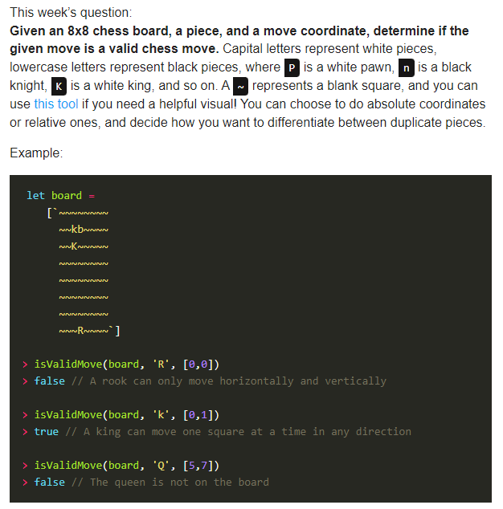

# Reptes setmanals
Repositori amb els reptes setmanals que ens proposen a l'IT-Academy

## Passar portes (20221018)

    20221018_proposta.js

Fa el que es demana.

## Print Tree (20221024)

    20221024_printTree.js

Fa el que es demana, en principi amb la mínima alçada necessària.

## Antidivisor (20221107)

    20221107_antidivisor.js

Fa el que es demana.

## Valid Chess (20221114)

    validChess.js
    function movimentValid(taulell, peca, moviment, fen=false)

`taulell`: Format com el de l'anunciat, o amb notació FEN.

`peca`: La peça s'indica en català, és a dir: P,C,A,T,D,R per a Peó, Cavall, Alfil, Torre, Dama i Rei respectivament. Com diu l'anunciat, majúscules per blanques, minúscules per negres.

`moviment`: Destí de la peça en notació algebraica. No cal especificar si és una captura amb una creu. És a dir, una captura al pas exf5 seria `peca='P'`, `moviment='f5'`.

`fen`: Indicar si la notació del taulell és fen o no.

### Què fa
* Moviment vàlid de peces.
* Determinar si la posició del tauler és legal en quant a:
    * Nombre de peons per banda
    * No hi ha peons a les files 1 i 8
    * Nombre de reis per banda
* Captura al pas!
* Fer enroc, i permetre-ho si les normes d'escac són vàlides (el rei no pot estar en escac i no pot passar per cap casella que ho estigui)
* També accepta com a input notació FEN per a la posició final, sense els epítets finals de privilegis d'enroc ni moviment anterior ni torn. Cap especificar-ho amb un paràmtre final `true`

### Què no fa
* Diferenciar entre dues peces que poden fer el mateix moviment. En un moviment que podria ser Cd2, en moltes obertures pot ser o Cbd2 o Cfd2. No diferencia, però si mínim una peça pot fer el moviment indicat la funció donarà el moviment com a vàlid.
* Comprovar el moviment anterior (cas de la captura al pas)
* Saber si el rei o la torre s'han mogut amb anterioritat pel cas de permetre l'enroc o no.
* Comprovar si un cop s'ha fet el moviment el rei està en escac (un peça clavada no s'hauria de poder moure).

## Barres/Contrabarres (20221129)

    20221129_barrescontrabarrres.js

Cal tenir en compte que la contrabarra ('\\') escapa el següent caràcter. Per això l'input a la funció no pot ser (o no he aconseguit fer) que sigui com a la imatge sinó que cal que sigui `String.raw'//\///\\'`

## Catan (20221205)

    20221212_catan.js
    function randomCatan()

Fa el que es demana.

## Rectangle (20221212)

    20221212_catan.js
    function sumaRectangle(n,m,a=0,b=0)

`n` i `m` són el que demana. Opcionalment també es poden donar els paràmetres `a` i `b` que són les dimensions del rectangle que ha de tenir l'array `n`. Si no es mencionen s'assumeix que `n` és un quadrat i es tracta com a tal.

Les cantonades a `m` no cal que estiguin en cap ordre, es busca qualsevol rectangle que contingui aquestes cantonades.

No té output, hi ha console.log que mencionen el resultat de la suma ja que hi poden haver varis rectangles. Podria retornar un array is volgués.

### No fa bé
Si dues o més cantonades contenen el mateix nombre, es duplica el resultat.

## Capital After Vowel (20230109)

    20230109.js
    function capitalAfterVowel(frase)

Potser una mica lleig i poc eficient, però fa el que demana.

## Sum Every Other

    20230109.js
    function sumEveryOther(nombre,parell=1)

Per defecte suma els nombres parells, saltant-se els punts decimals. Si vols sumar els números senars potser definir el segon paràmetre com a 0.

## Max subArray

    20230109.js
    function maxSubArray(m,n)

Fa el que demana.

## Replace zeros

    20230109.js
    function replaceZeros();

Fa el que demana.

### No fa

Tenir en compte si a l'String hi ha caràcters no-numèrics